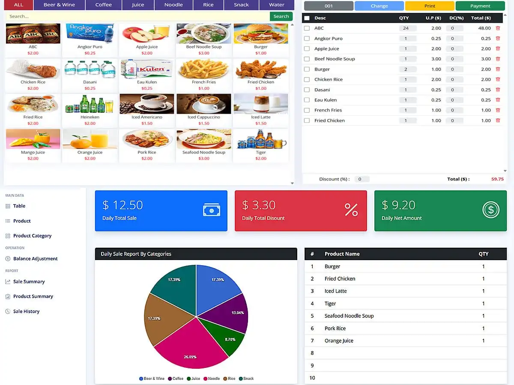

# Laravel jQuery POS Tutorial for Beginners
<p align="center"><a href="https://laravelcenter.com/laravel-jquery-pos-tutorial-for-beginners" target="_blank"></a></p>

[](https://laravel.com/)
[](https://jquery.com/)
[](https://getbootstrap.com/)
[](https://www.php.net/)
[]()

This repository contains the complete source code for the tutorial:  
👉 **Laravel jQuery POS Tutorial for Beginners – Full Guide**  
Read the full tutorial here:  
https://laravelcenter.com/laravel-jquery-pos-tutorial-for-beginners/

This project is built for **beginner developers** who want to learn how to create a complete POS system using **Laravel, jQuery, Bootstrap, and Ajax**. You will learn important concepts such as CRUD operations, product management, POS cart logic, and more.

---

## 🚀 Features

- Beginner-friendly Laravel POS structure  
- POS dashboard with Bootstrap  
- jQuery-powered UI interactions  
- Ajax CRUD for products and categories  
- POS cart system with quantity updates  
- Automatic total, subtotal, and grand total calculation  
- Clean and simple code for easy understanding  
- Ready to extend with reporting or advanced features  

---

## 🛠 Installation

```bash
# Clone this repository
git clone https://github.com/YourUsername/laravel-jquery-pos-beginners.git
cd laravel-jquery-pos-beginners

# Install backend dependencies
composer install

# Install frontend dependencies
npm install

# Compile frontend assets
npm run dev

# Create environment file
cp .env.example .env
php artisan key:generate

# Run database migrations
php artisan migrate

# Link storage (if using images)
php artisan storage:link

# Start development server
php artisan serve

```

## 📦 Tech Stack
- Laravel 12
- jQuery 3
- Bootstrap 5
- Ajax
- PHP 8.3
- MySQL

## 🔗 Tutorial
Follow the full step-by-step tutorial here:
[**https://laravelcenter.com/laravel-jquery-pos-tutorial-for-beginners**](https://laravelcenter.com/laravel-jquery-pos-tutorial-for-beginners/)

## 📌 Topics / Tags
`laravel` | `jquery` | `bootstrap` | `ajax` | `crud` | `mysql` | `pos` | `point-of-sale` | `sales-system` | `laravel-tutorial` | `beginner-friendly`


## ⭐ Support
If you found this project helpful, please star the repository ⭐    
Your support motivates me to create more free tutorials!